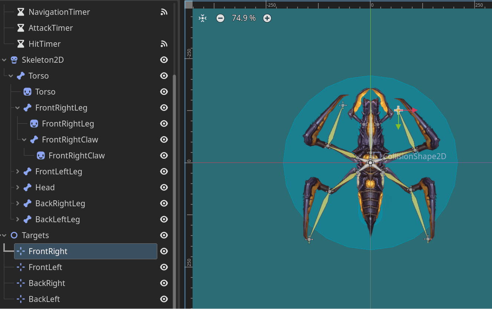

# My Godot 4 Exploration Project

Welcome to my project documentation where I delve into the open-source game engine, Godot 4. This project is inspired by the comprehensive tutorial "[The ultimate introduction to Godot 4](https://www.youtube.com/watch?v=nAh_Kx5Zh5Q)" which can be found here.

Throughout this journey, I've explored various features and capabilities of Godot 4, including:

- **Scripting with GDScript**: Learning the basics and advanced concepts of Godot's native scripting language.
- **2D and 3D Game Development**: Experimenting with both 2D and 3D game mechanics, graphics, and physics.
- **Animation**: Utilizing the animation tools to bring characters and environments to life.
- **UI Development**: Designing user interfaces with responsive and intuitive controls.
- **Audio Integration**: Implementing sound effects and music to enhance the gaming experience.
- **Shaders**: Writing custom shaders for unique visual effects.
- **Project Organization**: Structuring the project for maintainability and scalability.
- **Version Control**: Using Git for source control management within Godot.

This project serves as a testament to my growth as a game developer and my ability to adapt to new tools and workflows. I hope it can also be a resource for others looking to explore Godot 4.

## Gameplay and Features

### Enemy and Explosion
  
*In this scene, you can see the dynamic interaction between the player, enemies, and the resulting explosions upon contact.*

### 2D Lights and Camera Tween
  
*Here we showcase the use of 2D lights and camera movements to create a more immersive experience.*

### Entering a Zone + Enemy AI
  
*This GIF demonstrates the player entering a new zone and the responsive enemy AI that inhabits it.*

### Lootboxes and Item Pickups
  
*Collectibles and lootboxes add an element of reward and surprise to the game.*

### Skeleton2D Manipulation in Editor
  
*Here's a peek at the animation process, manipulating a Skeleton2D in the Godot editor.*